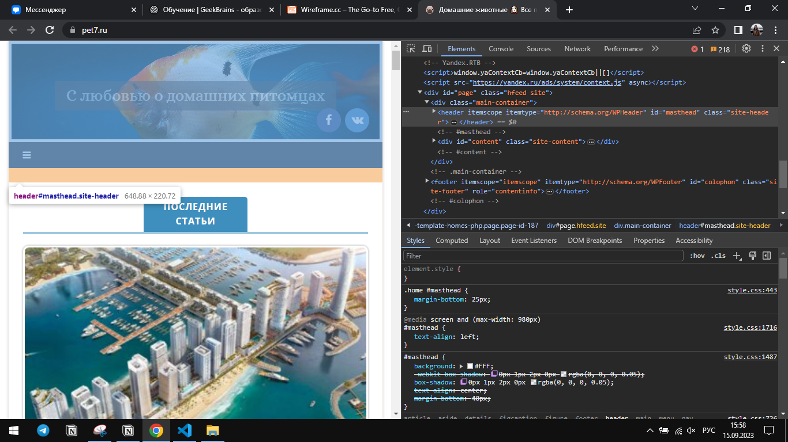
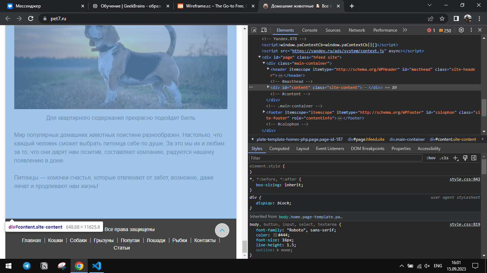
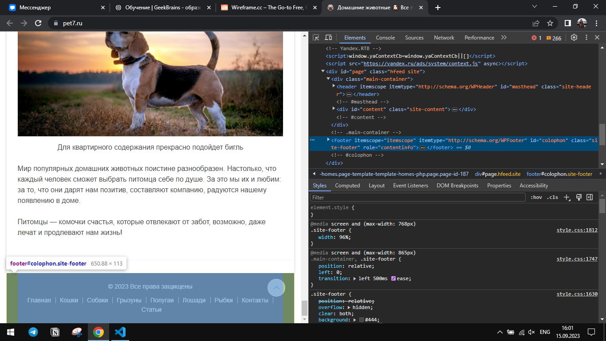
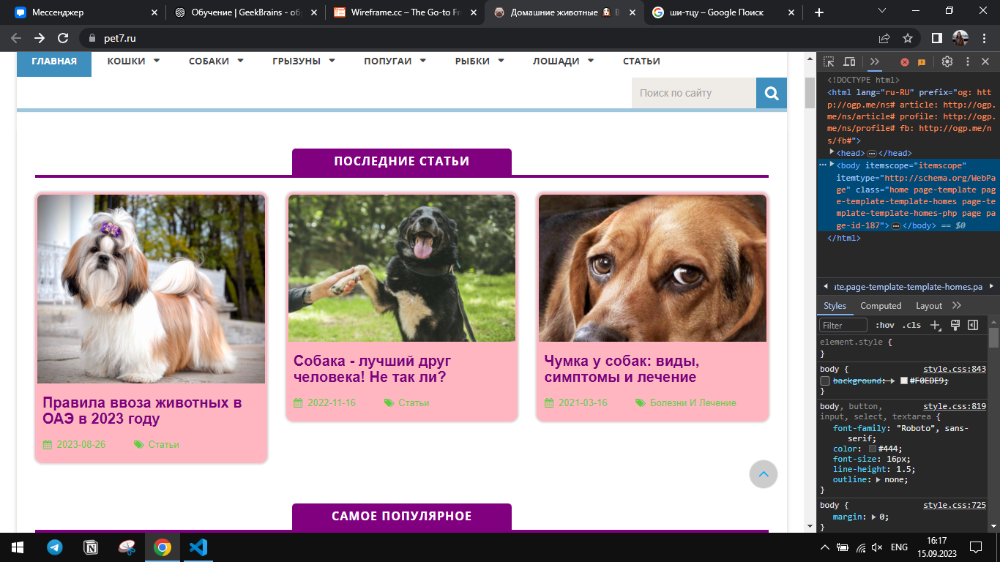
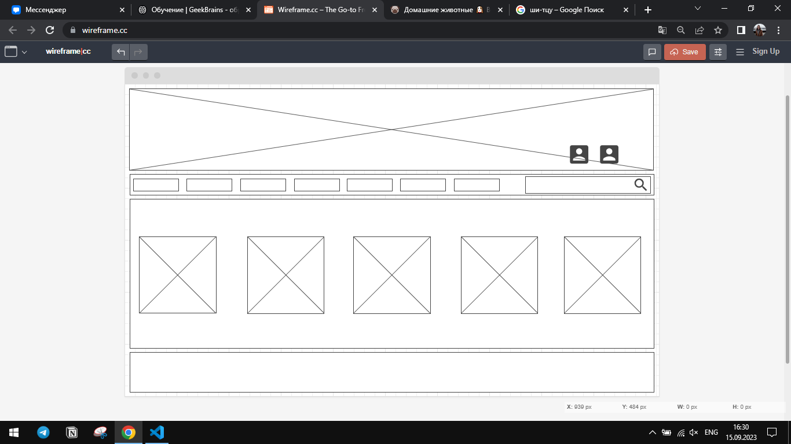

# Знакомство с веб-технологиями. Домашнее задание к семинару 1.

1. Определить, на каком протоколе работает сайт.

    Сайт работает на протоколе HTTPS.

2. Проанализировать структуру сайта.

### Header

### Content

### Footer

3. Внести несколько изменений.

4. Создать прототим низкой детализации.

